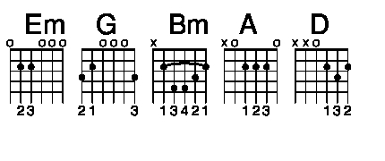
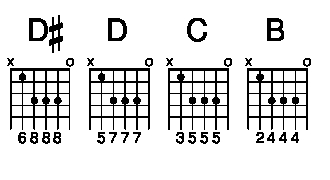

<code>
  <pre>
    
Ladykillers

tab by Lush

    
    
    [Intro]
    
      e|------------------------------------------------|
      B|------------------------------------------------|
      G|------------------------------------------------|
      D|------------------------------------------------|
      A|--------2-0---------2-0-2------0-2-0---3-3-3-2--|
      E|--0-3-0-----3-0-0-3--------0-3-------3----------|
    
    X 2
    
      e|---------------------------------------|
      B|---------------------------------------|
      G|---------------------------------------|
      D|---------------------------------------|
      A|--000----------------------------------|
      E|------3--2--2-2-2-2-2-2--2-2-2-2-2-2-2-|
    
    [Verse 1]
    Em G Bm A G
    Em G Bm A G
    [Verse 2]
    D A Em D D# D D Em C
    B~
    D A Em D D# D D Em C
    Bx4
    [Chorus]
    C Em C Em C Em
    C B
    C Em C Em C Em
    C B
    [Music Break]
    
      e|------------------------------------------------|
      B|------------------------------------------------|
      G|------------------------------------------------|
      D|------------------------------------------------|
      A|--7-5-----77-5-----77-5-----3-3-3-2--|
      E|------7-5------7-5------7-5----------|
    
    
      e|---------------------------------------|
      B|---------------------------------------|
      G|---------------------------------------|
      D|---------------------------------------|
      A|--000----------------------------------|
      E|------3--2--2-2-2-2-2-2--2-2-2-2-2-2-2-|
    
  </pre>
</code>
