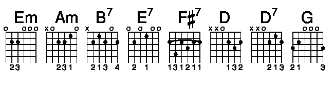

<code>
  <pre>
    <a href="https://tabs.ultimate-guitar.com/tab/mary-hopkin/those-were-the-days-chords-1054310">
Those Were The Days chords

Mary Hopkin  1968

(Gene Raskin "Dorogoi dlinnoyu" by Boris Fomin)
</a>
    Capo II
    
    [Intro]    
     Em Am B7 Em    
     
    [Verse]
    Em                                Em    
    Once upon a time, there was a tavern
    E7                                Am    
    Where we used to raise a glass or two    
    Em                                Em    
    Remember how we laughed away the hours,    
    F#7                                   B7    
    Think of all the great things we would do    
     
    
    [Chorus]    
                   Em    
    Those were the days, my friend    
                      Am    
    We thought they'd never end    
                  D        D7         G    
    We'd sing and dance forever and a day    
                  Am    
    We'd live the life we'd choose    
                   Em    
    We'd fight and never lose    
                B7                         Em    
    For we were young and sure to have our way    
     
    
    [Music Break]    
    B7       Em    
    La La La La La La La La    
    Am    
    La La La La La La    
          B7                   Em    
    La La La La La La La La La La    
     
    
    [Verse]    
    Em                                Em    
    Then, the busy years went rushing by us    
    E7                                Am    
    We lost our starry notions on the way    
    Em                                Em    
    If, by chance, I'd see you in the tavern,    
         F#7                          B7    
    We'd smile at one another and we'd say    
     
    
    [Chorus]    
                   Em    
    Those were the days, my friend    
                      Am    
    We thought they'd never end    
                  D        D7         G    
    We'd sing and dance forever and a day    
                  Am    
    We'd live the life we'd choose    
                   Em    
    We'd fight and never lose    
                B7                         Em    
    For we were young and sure to have our way    
     
    
    [Music Break]    
    B7       Em    
    La La La La La La La La    
    Am    
    La La La La La La    
          B7                   Em    
    La La La La La La La La La La    
     
    
    [Verse]    
    Em                                Em    
    Just tonight, I stood before the tavern    
    E7                                Am    
    Nothing seemed the way it used to be    
    Em                                Em    
    In the glass, I saw a strange reflection    
    F#7                         B7    
    Was that lonely woman really me?    
     
    
    [Chorus]    
                   Em    
    Those were the days, my friend    
                      Am    
    We thought they'd never end    
                  D        D7         G    
    We'd sing and dance forever and a day    
                  Am    
    We'd live the life we'd choose    
                   Em    
    We'd fight and never lose    
                B7                         Em    
    For we were young and sure to have our way    
     
    
    [Music Break]    
    B7       Em    
    La La La La La La La La    
    Am    
    La La La La La La    
          B7                   Em    
    La La La La La La La La La La    
     
    
    [Chorus]    
    Em    
    La ...
    Am    
    La ...
    D        D7         G    
    La ...
    Am    
    La ...
    Em    
    La ...
    B7        Em    
    La ...
     
    
    [Verse]    
    Em                                Em    
    Through the door, there came familiar laughter    
    E7                                    Am    
    I saw your face and heard you call my name    
    Em                                Em    
    Oh, my friend, we're older but no wiser    
    F#7                                        B7    
    For in our hearts, the dreams are still the same    
     
    
    [Chorus]    
                   Em    
    Those were the days, my friend    
                      Am    
    We thought they'd never end    
                  D        D7         G    
    We'd sing and dance forever and a day    
                  Am    
    We'd live the life we'd choose    
                   Em    
    We'd fight and never lose    
                B7                         Em    
    For we were young and sure to have our way    
     
    
    [Music Break]    
    Em    
    La La La La La La    
    Am    
    La La La La La La    
          B7                   Em    
    La La La La La La La La La La     
         
    
    [Chorus]    
    Em    
    La ...
    Am    
    La ...
    D        D7         G    
    La ...
    Am    
    La ...
    Em    
    La ...
    B7        Em    
    La ...
     
         
  </pre>
</code>
